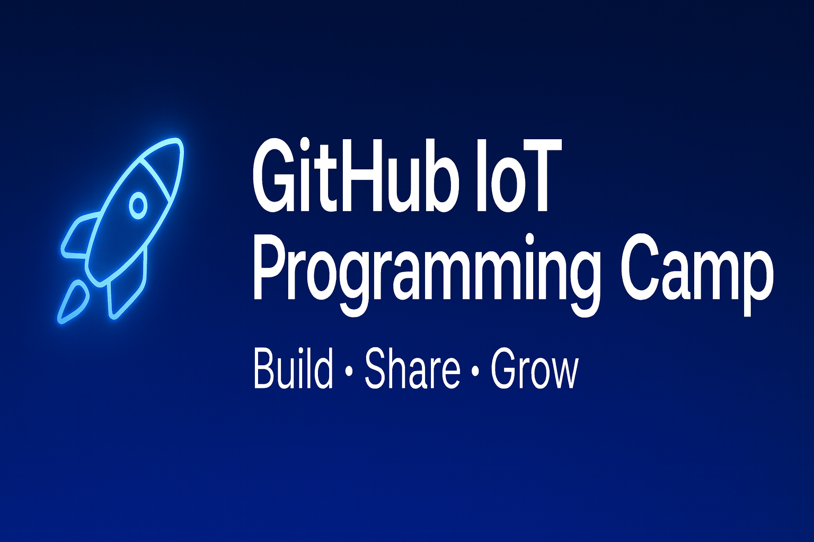

  

# 🖐️ GitHub 활용 사물인터넷 프로그래밍 캠프 – My Project  
> 오픈소스 생태계와 IoT 장비를 연결하는 학습 & 실습 프로젝트  

## 📌 프로젝트 개요  
이 저장소는 **GitHub을 중심으로 오픈소스 생태계 속에서 IoT 장비를 운영해보는 학습-실습용 프로젝트**입니다.  
- 생활 속 오픈소스 활용을 경험하고,  
- Git / GitHub을 통한 협업 · 버전관리 방법을 익히며,  
- 실제 IoT 장비(예: FPGA + PMOD)를 제어해보는 일련의 세션으로 구성되어 있습니다.  
- 이 프로젝트는 캠프 수강생들이 **자기만의 아이디어를 자유롭게 표현하고 공유할 수 있는 플랫폼**으로 기획되었습니다.  

## 🎯 목표  
- 오픈소스 기반 개발 환경 설정 및 이해  
- Git / GitHub을 통한 코드·문서 관리 및 포트폴리오 구축  
- IoT 하드웨어 제어 실습(내부 LED/Switch, PMOD 제어 등)  
- 팀 또는 개인 프로젝트 과제를 통해 학습한 내용을 실제 동작으로 구현  

## 🗂 세션 구성  
| 세션 | 내용 | 주요 활동 |
|------|------|------------|
| **Session 1 – Environment Setup** | 개발환경, 협업도구 셋업 | 이메일 제출, Notion 초대, Slack 구성, 유틸리티 다운로드 |
| **Session 2 – Git Practice** | Git 개념과 실습 | Git 설치·설정, GitHub 리포지토리 생성, Markdown 작성, Git CLI 및 GUI(SourceTree) 실습 |
| **Session 3 – IoT Practice** | FPGA/PMOD 기반 하드웨어 제어 | Zynq-7000 내부 LED/Switch 제어, PMOD 확장모듈 제어 실습 |

## 🧩 주요 기능 및 실습 항목
Git / GitHub 기반 버전관리 및 협업 흐름 체험
하드웨어 제어 실습: 내부 LED/Switch, PMOD 제어
문서관리: Notion + Slack 통합워크플로
팀/개인 프로젝트를 통한 아이디어 구현 및 공유

## 🧰 개발환경 & 도구 목록  
아래는 본 프로젝트에서 사용하는 주요 툴입니다.  
- [Visual Studio Code](https://code.visualstudio.com/docs/?dv=win64user) – 확장이 가능한 오픈소스 코드 에디터  
- [SourceTree](https://product-downloads.atlassian.com/software/sourcetree/windows/ga/SourceTreeSetup-3.4.26.exe) – Git GUI 클라이언트  
- [Notion](https://www.notion.com/desktop/windows/download?from=marketing&pathname=%2Fdesktop&tid=c9e76650c69f4474985da99843f9b1be) – 노트 및 문서관리 툴  
- [Slack](https://slack.com/downloads/instructions/windows?ddl=1&build=win64_msix) – 팀 커뮤니케이션 메신저  
- [Git](https://github.com/git-for-windows/git/releases/download/v2.51.2.windows.1/Git-2.51.2-64-bit.exe) – 버전관리 프로그램  
- [TeraTerm](https://github.com/TeraTermProject/teraterm/releases/download/v5.5.0/teraterm-5.5.0-x64.exe) – 외부 장비 터미널 연결 프로그램  
